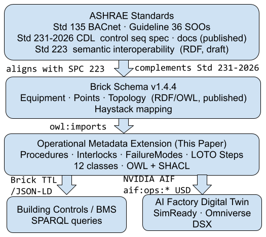

# An Operational Metadata Extension to Brick for AI Factories

*Technical report · Visum AI · v0.1 · June 2026*

*Schema files, SHACL shapes, and worked extractions: [github.com/Visum-ai/aif-ops](https://github.com/Visum-ai/aif-ops)*

Brick Schema v1.4.4 models HVAC equipment, sensors, and building topology but has no vocabulary for the documents that guide human operations of that equipment: procedures, sequences, interlocks, failure modes, maintenance tasks, commissioning steps, and lockout-tagout steps that on-shift operators execute and rely on. AI factories (large-scale GPU cluster facilities with direct liquid cooling) depend on these entities as much as any legacy data center does, and increasingly operate under formal tier certification and safety-compliance requirements that demand exactly this kind of structured operational metadata.

This report proposes a Brick operational metadata extension that adds 12 entity classes and 35 predicates to cover that gap. The extension publishes as a standalone OWL ontology that `owl:imports` Brick v1.4.4, ships with paired SHACL shapes for each new class, and provides a dual binding to NVIDIA AIF `aif:ops:*` USD attributes for digital-twin use. Two worked extractions demonstrate the extension against published vendor and open-standard documentation: the Vertiv XDU1350B O&M manual and the OCP Project Deschutes CDU design specification (Google, OCP 2025).

## 1. Brick formalism in one section

Brick is not a new schema language. It is a vocabulary expressed in a stack of W3C standards. Five terms recur throughout this report.

**RDF (Resource Description Framework).** The W3C-standard data model for semantic graphs. Every fact in an RDF graph is a triple: a subject, a predicate, and an object. The triple `:CDU_1 brick:hasPoint :Leak_Sensor_1` says CDU_1 has a point named Leak_Sensor_1. Serialization formats (Turtle, JSON-LD, RDF/XML) are interchangeable.

**OWL (Web Ontology Language).** A W3C-standard layer on top of RDF for declaring classes and properties with formal semantics. OWL enables inference: a SPARQL query for all chillers returns centrifugal chillers and absorption chillers without enumerating subclasses.

**SPARQL.** The W3C-standard query language for RDF graphs. Same role SQL plays for relational tables.

**SHACL (Shapes Constraint Language).** A W3C-standard language for validating RDF graphs against constraints. Given a graph plus a set of shapes, a SHACL validator returns a pass/fail report. The Brick Consortium uses SHACL for ASHRAE Guideline 36 conformance checking. This extension adopts the same pattern.

**Common namespace prefixes:**

- `brick:` — Brick namespace
- `rdf:`, `rdfs:`, `owl:` — W3C core namespaces
- `sh:` — SHACL
- `aif-ops:` — this extension's namespace (`https://visum.ai/ns/aif-ops#`)
- `aif:` — NVIDIA AI Factory namespace (`aif:core:*`, `aif:spec:*`, proposed `aif:ops:*`)

## 2. Position in the ASHRAE standards landscape



**Figure 1.** Where the operational extension sits. The ASHRAE standards and guidelines (Std 135 BACnet, Guideline 36 sequences of operation, Std 231-2026 CDL control-sequence specification, and proposed Std 223P semantic data model) sit above Brick Schema v1.4.4, which aligns with 223P and complements Std 231-2026. The operational metadata extension `owl:imports` Brick and serializes out to Brick TTL/JSON-LD for building controls and BMS SPARQL queries, and to NVIDIA AIF `aif:ops:*` USD for the AI factory digital twin (SimReady, Omniverse DSX).

**ASHRAE Standard 135 (BACnet).** Transport and device-communication protocol for HVAC and building systems. BACnet defines how devices exchange messages. This extension does not change the BACnet layer.

**ASHRAE Standard 231-2026 (Control Description Language).** Codifies CDL for machine-readable control logic. 231 is the closed-loop control surface: the BAS runs sequences by itself. This extension is the human-procedure surface: MOPs, SOPs, EOPs, and LOTO steps that an operator executes. The two are complementary. `Sequence` here means an ordered operator procedure outside the controller runtime; `Action` means an operator step, not a controller block.

**ASHRAE Standard 223P (Semantic Data Model).** The parallel ASHRAE semantic model for building topology and equipment relationships. It overlaps Brick in purpose. This extension lands first as a Brick contribution; a starter 223P mapping for all 12 operational entity classes appears in Section 9.

**ASHRAE Guideline 36.** The G36 SHACL conformance approach mirrors this extension: ship SHACL shapes that assert correctness against a populated graph rather than bloating the class vocabulary.

**Adjacent published work.** Meta uses the Modelica Buildings Library and CDL for physics-based digital twins of hyperscale data centers (Rivalin et al. 2023). That surface is physics-based prediction. This extension is the human-procedure surface adjacent to it. The LBNL modelica-json tool already emits Brick TTL from Modelica annotations; the operational entities proposed here are candidates for that export path.

## 3. Gap analysis against Brick v1.4.4

Every operational field the extension proposes is mapped against current Brick coverage. Three coverage states: **Covered**, **Partial**, **Missing**. Validated against the published 1.7 MB Brick v1.4.4 TTL on 2026-05-20.

### 3.1 Equipment classes

| Equipment concept | Brick v1.4.4 coverage | Closest existing class | Proposed addition |
|---|---|---|---|
| Coolant Distribution Unit | Missing | none | `aif-ops:Coolant_Distribution_Unit` |
| Rear-Door Heat Exchanger | Missing | none | `aif-ops:Rear_Door_Heat_Exchanger` |
| Liquid-cooling manifold | Missing | none | `aif-ops:Liquid_Cooling_Manifold` (with `Row_Manifold`, `Rack_Manifold` subclasses) |
| Cold plate (direct-to-chip) | Missing | none | `aif-ops:Cold_Plate` |
| Immersion cooling tank | Missing | none | `aif-ops:Immersion_Cooling_Tank` |
| Dry cooler | Missing | `Cooling_Tower` (water-cooled only) | `aif-ops:Dry_Cooler` |
| GPU rack | Missing | `ICT_Equipment` exists but no compute hierarchy | `aif-ops:GPU_Rack`, parent `aif-ops:Compute_Equipment` |
| Rack PDU | Partial | `Breaker_Panel` exists; no rack-PDU class | `aif-ops:Rack_PDU` |
| Busway | Missing | none | `aif-ops:Busway` |

### 3.2 Operational entity classes

12 proposed additions. 0 fully covered today; 2 partially covered (`Event` via `Alarm`, `IsolationPoint` via `Isolation_Valve`).

| Operational concept | Brick v1.4.4 coverage | Proposed addition |
|---|---|---|
| Procedure (MOP, SOP, EOP) | Missing | `aif-ops:Procedure`, with `MOP`, `SOP`, `EOP` subclasses |
| Sequence of operations | Missing | `aif-ops:Sequence`, ordered set of `aif-ops:Action`; each Action carries `on_failure` path for conditional branching |
| Atomic operator action | Missing | `aif-ops:Action` (subclasses: `ManualAction`, `AutomatedAction`, `VerificationAction`); carries `verb` from a closed 10-word vocabulary |
| Actor (role authorized to act) | Missing | `aif-ops:Actor`, with four named individuals: `Operator`, `Technician`, `SafetyOfficer`, `SystemAutomation`; linked via `performedBy`, `approvedBy`, `authorizedEmployee` |
| Operating mode | Missing | `aif-ops:OperatingMode`, with `transitionsTo` for the allowed transition set |
| Event (alarm fires, mode change) | Partial | `aif-ops:Event`, with `triggers` linking to a Procedure |
| Interlock | Missing | `aif-ops:Interlock`, with `gatesAction`, `requires`, `prohibits`; `hard_or_soft` attribute |
| Failure mode (FMEA) | Missing | `aif-ops:FailureMode`, with `hasDetectionSignature`, `mitigatedBy` |
| Maintenance task | Missing | `aif-ops:MaintenanceTask` (abstract), with two concrete subclasses: `ScheduledMaintenanceTask` (`recursEvery xsd:duration`) and `OnConditionMaintenanceTask` (`hasTriggerCondition` literal) |
| Commissioning step | Missing | `aif-ops:CommissioningStep`, with `hasPassCriteria`, `hasFailCriteria` |
| Isolation point | Partial | `aif-ops:IsolationPoint` (umbrella: valves, breakers, disconnects), predicate `isIsolatedBy` |
| Lockout/tagout step | Missing | `aif-ops:LockoutTagoutStep`, with `partOfProcedure` |

### 3.3 Relationship vocabulary

35 predicates connect the new operational entities to Brick's existing equipment, point, and location graph. They split into three groups.

**Inter-class relationship predicates (object properties):**

| Predicate | Domain → Range | Purpose |
|---|---|---|
| `aif-ops:hasProcedure` | Equipment → Procedure | Equipment has a documented operator procedure |
| `aif-ops:executesOn` | Procedure → Equipment | Procedure points back to its equipment |
| `aif-ops:hasSequence` | Procedure → Sequence | Procedure contains a Sequence |
| `aif-ops:hasAction` | Sequence → Action | Sequence contains Actions |
| `aif-ops:on_failure` | Action → Action | Conditional branch on step failure |
| `aif-ops:performedBy` | Action → Actor | Actor who executes the action |
| `aif-ops:approvedBy` | Procedure → Actor | Actor who approves before execution |
| `aif-ops:authorizedEmployee` | LockoutTagoutStep → Actor | Actor authorized for this LOTO step |
| `aif-ops:hasInterlock` | Equipment → Interlock | Equipment is gated by an interlock |
| `aif-ops:gatesAction` | Interlock → Action | Interlock controls whether an action proceeds |
| `aif-ops:requires` | Interlock → (open) | Condition an interlock requires |
| `aif-ops:prohibits` | Interlock → (open) | Condition an interlock prohibits |
| `aif-ops:hasFailureMode` | Equipment → FailureMode | Equipment has a documented failure mode |
| `aif-ops:hasDetectionSignature` | FailureMode → Point | Failure mode detected via sensor or alarm |
| `aif-ops:mitigatedBy` | FailureMode → Procedure | Failure mode has a mitigation procedure |
| `aif-ops:hasMaintenanceTask` | Equipment → MaintenanceTask | Equipment requires a maintenance task |
| `aif-ops:requiresPart` | MaintenanceTask → (open) | Task consumes a part or consumable |
| `aif-ops:isIsolatedBy` | Equipment → IsolationPoint | Equipment instance is isolated via a named point |
| `aif-ops:hasIsolationProcedure` | IsolationPoint → Procedure | Isolation point has a governing procedure |
| `aif-ops:hasOperatingMode` | Equipment → OperatingMode | Equipment can be in a discrete operating mode |
| `aif-ops:transitionsTo` | OperatingMode → OperatingMode | Declares valid next states |
| `aif-ops:entry_conditions` | OperatingMode → Point | Brick sensor points that define entry into this mode |
| `aif-ops:exit_conditions` | OperatingMode → Point | Brick sensor points that define exit from this mode |
| `aif-ops:triggers` | Event → Procedure | Event triggers a procedure |
| `aif-ops:hasCommissioningStep` | Equipment → CommissioningStep | Equipment has a commissioning step |
| `aif-ops:partOfProcedure` | LockoutTagoutStep → Procedure | LOTO step belongs to a procedure |

**Within-class datatype properties:**

| Predicate | Domain | Range | Purpose |
|---|---|---|---|
| `aif-ops:sequenceOrder` | Sequence | xsd:integer | 1-indexed position of this Sequence within its parent Procedure |
| `aif-ops:sequencePhase` | Sequence | xsd:string | Closed vocabulary: `pre` (isolation/LOTO/preparation), `core` (maintenance/verification), `post` (de-isolation/return-to-service). Absent means the procedure is not split into phases |
| `aif-ops:stepOrder` | Action | xsd:integer | 1-indexed position within parent Sequence |
| `aif-ops:verb` | Action | xsd:string | Closed vocabulary: Start, Stop, Open, Close, Set, Reset, Wait, Compare, Jump, Verify |
| `aif-ops:hard_or_soft` | Interlock | xsd:string | "hard" (cannot be overridden) or "soft" (can be bypassed by authorized Actor) |
| `aif-ops:recursEvery` | ScheduledMaintenanceTask | xsd:duration | ISO 8601 recurrence interval |
| `aif-ops:hasTriggerCondition` | OnConditionMaintenanceTask | rdfs:Literal | Prose description of the condition that triggers service |
| `aif-ops:hasPassCriteria` | CommissioningStep | rdfs:Literal | Pass criterion for the commissioning step |
| `aif-ops:hasFailCriteria` | CommissioningStep | rdfs:Literal | Fail criterion for the commissioning step |

**Annotation properties:**

| Predicate | Purpose |
|---|---|
| `aif-ops:hasSource` | Cites the source document, section, and page for any resource node |
| `aif-ops:sourceKind` | Classifies the authority: `normative`, `vendor_default`, `site_setting`, `sme_confirmed` |

### 3.4 Coverage summary

- Equipment classes: 9 proposed additions, 0 fully covered, 1 partially covered.
- Operational entity classes: 12 proposed additions, 0 fully covered, 2 partially covered.
- Relationship vocabulary: 35 predicates (26 object properties, 7 datatype properties, 2 annotation properties).

## 4. Draft RDF/OWL declarations

The extension publishes as a standalone OWL ontology under `https://visum.ai/ns/aif-ops#` that `owl:imports` Brick v1.4.4. The full file is `aif_ops.ttl` in the repository root. An illustrative subset:

```turtle
@prefix aif-ops: <https://visum.ai/ns/aif-ops#> .
@prefix brick:   <https://brickschema.org/schema/Brick#> .
@prefix owl:     <http://www.w3.org/2002/07/owl#> .
@prefix rdfs:    <http://www.w3.org/2000/01/rdf-schema#> .
@prefix xsd:     <http://www.w3.org/2001/XMLSchema#> .

<https://visum.ai/ns/aif-ops>
    a owl:Ontology ;
    owl:imports <https://brickschema.org/schema/1.4.4/Brick> ;
    rdfs:label "AIF Operations Extension to Brick" .

# Equipment classes
aif-ops:Coolant_Distribution_Unit a owl:Class ;
    rdfs:subClassOf brick:HVAC_Equipment ;
    rdfs:label "Coolant Distribution Unit" .

# Operational entity classes
aif-ops:Procedure  a owl:Class ; rdfs:label "Procedure" .
aif-ops:MOP        a owl:Class ; rdfs:subClassOf aif-ops:Procedure ; rdfs:label "Method of Procedure" .
aif-ops:SOP        a owl:Class ; rdfs:subClassOf aif-ops:Procedure ; rdfs:label "Standard Operating Procedure" .
aif-ops:EOP        a owl:Class ; rdfs:subClassOf aif-ops:Procedure ; rdfs:label "Emergency Operating Procedure" .
aif-ops:Sequence   a owl:Class ; rdfs:label "Sequence" .
aif-ops:Action     a owl:Class ; rdfs:label "Action" .
aif-ops:ManualAction     a owl:Class ; rdfs:subClassOf aif-ops:Action .
aif-ops:AutomatedAction  a owl:Class ; rdfs:subClassOf aif-ops:Action .
aif-ops:VerificationAction a owl:Class ; rdfs:subClassOf aif-ops:Action .
aif-ops:Actor      a owl:Class ; rdfs:label "Actor" .

# Named Actor individuals
aif-ops:Operator         a aif-ops:Actor ; rdfs:label "Operator" .
aif-ops:Technician       a aif-ops:Actor ; rdfs:label "Technician" .
aif-ops:SafetyOfficer    a aif-ops:Actor ; rdfs:label "Safety Officer" .
aif-ops:SystemAutomation a aif-ops:Actor ; rdfs:label "System Automation" .

aif-ops:OperatingMode a owl:Class ; rdfs:label "Operating Mode" .
aif-ops:Event         a owl:Class ; rdfs:label "Event" .
aif-ops:Interlock     a owl:Class ; rdfs:label "Interlock" .
aif-ops:FailureMode   a owl:Class ; rdfs:label "Failure Mode" .
aif-ops:IsolationPoint a owl:Class ; rdfs:label "Isolation Point" .
aif-ops:LockoutTagoutStep a owl:Class ; rdfs:label "Lockout Tagout Step" .
aif-ops:MaintenanceTask          a owl:Class ; rdfs:label "Maintenance Task" .
aif-ops:ScheduledMaintenanceTask a owl:Class ; rdfs:subClassOf aif-ops:MaintenanceTask .
aif-ops:OnConditionMaintenanceTask a owl:Class ; rdfs:subClassOf aif-ops:MaintenanceTask .
aif-ops:CommissioningStep a owl:Class ; rdfs:label "Commissioning Step" .

# Key predicates
aif-ops:performedBy a owl:ObjectProperty ;
    rdfs:domain aif-ops:Action ; rdfs:range aif-ops:Actor .
aif-ops:approvedBy a owl:ObjectProperty ;
    rdfs:domain aif-ops:Procedure ; rdfs:range aif-ops:Actor .
aif-ops:on_failure a owl:ObjectProperty ;
    rdfs:domain aif-ops:Action ; rdfs:range aif-ops:Action .
aif-ops:verb a owl:DatatypeProperty ;
    rdfs:domain aif-ops:Action ; rdfs:range xsd:string .
aif-ops:isIsolatedBy a owl:ObjectProperty ;
    rdfs:domain brick:Equipment ; rdfs:range aif-ops:IsolationPoint .
aif-ops:recursEvery a owl:DatatypeProperty ;
    rdfs:domain aif-ops:ScheduledMaintenanceTask ; rdfs:range xsd:duration .
aif-ops:hasTriggerCondition a owl:DatatypeProperty ;
    rdfs:domain aif-ops:OnConditionMaintenanceTask ; rdfs:range rdfs:Literal .
aif-ops:hasSource    a owl:AnnotationProperty .
aif-ops:sourceKind   a owl:AnnotationProperty .
```

## 5. SHACL shapes for each operational entity class

Full shapes file: `aif_ops_shapes.ttl` in the repository root. Run validation with:

```bash
pyshacl -s aif_ops_shapes.ttl -e aif_ops.ttl \
        -df turtle -f table examples/ocp-deschutes-extraction.ttl
```

### 5.1 CDU shape

```turtle
aif-ops-shapes:CDU_Shape a sh:NodeShape ;
    sh:targetClass aif-ops:Coolant_Distribution_Unit ;
    sh:property [ sh:path aif-ops:hasFailureMode ; sh:minCount 1 ; sh:class aif-ops:FailureMode ] ;
    sh:property [ sh:path aif-ops:isIsolatedBy ; sh:minCount 1 ; sh:class aif-ops:IsolationPoint ] ;
    sh:property [ sh:path aif-ops:hasMaintenanceTask ; sh:minCount 1 ; sh:class aif-ops:MaintenanceTask ] ;
    sh:property [ sh:path brick:hasPoint ; sh:qualifiedValueShape [ sh:class brick:Leak_Detection_Sensor ] ;
                  sh:qualifiedMinCount 1 ] ;
    sh:property [ sh:path brick:feeds ;
                  sh:qualifiedValueShape [ sh:or (
                      [ sh:class aif-ops:Cold_Plate ]
                      [ sh:class aif-ops:Rear_Door_Heat_Exchanger ]
                      [ sh:class aif-ops:Immersion_Cooling_Tank ]
                      [ sh:class aif-ops:Liquid_Cooling_Manifold ]
                  ) ] ;
                  sh:qualifiedMinCount 1 ] .
```

### 5.2 Operational entity class shapes (plus Actor and cross-cutting shapes)

```turtle
# Procedure: must reference equipment and at least one sequence; approvedBy must reference an Actor
aif-ops-shapes:Procedure_Shape a sh:NodeShape ;
    sh:targetClass aif-ops:Procedure ;
    sh:property [ sh:path aif-ops:executesOn ; sh:minCount 1 ; sh:class brick:Equipment ] ;
    sh:property [ sh:path aif-ops:hasSequence ; sh:minCount 1 ; sh:class aif-ops:Sequence ] ;
    sh:property [ sh:path aif-ops:approvedBy ; sh:minCount 0 ; sh:class aif-ops:Actor ] .

# Sequence: must contain at least one Action; optional phase and ordering
aif-ops-shapes:Sequence_Shape a sh:NodeShape ;
    sh:targetClass aif-ops:Sequence ;
    sh:property [ sh:path aif-ops:hasAction ; sh:minCount 1 ; sh:class aif-ops:Action ] ;
    sh:property [ sh:path aif-ops:sequenceOrder ; sh:maxCount 1 ; sh:datatype xsd:integer ;
                  sh:minInclusive 1 ] ;
    sh:property [ sh:path aif-ops:sequencePhase ; sh:maxCount 1 ; sh:datatype xsd:string ;
                  sh:in ( "pre" "core" "post" ) ] .

# Action: must declare actor, step position, and optional verb/failure branch
aif-ops-shapes:Action_Shape a sh:NodeShape ;
    sh:targetClass aif-ops:Action ;
    sh:property [ sh:path aif-ops:performedBy ; sh:minCount 1 ; sh:maxCount 1 ;
                  sh:class aif-ops:Actor ] ;
    sh:property [ sh:path aif-ops:stepOrder ; sh:minCount 1 ; sh:maxCount 1 ;
                  sh:datatype xsd:integer ; sh:minInclusive 1 ] ;
    sh:property [ sh:path aif-ops:verb ; sh:maxCount 1 ; sh:datatype xsd:string ;
                  sh:in ( "Start" "Stop" "Open" "Close" "Set" "Reset" "Wait" "Compare" "Jump" "Verify" ) ] ;
    sh:property [ sh:path aif-ops:on_failure ; sh:maxCount 1 ; sh:class aif-ops:Action ] .

# Actor: must have a label
aif-ops-shapes:Actor_Shape a sh:NodeShape ;
    sh:targetClass aif-ops:Actor ;
    sh:property [ sh:path rdfs:label ; sh:minCount 1 ; sh:nodeKind sh:Literal ] .

# OperatingMode: transitions must point at another OperatingMode
aif-ops-shapes:OperatingMode_Shape a sh:NodeShape ;
    sh:targetClass aif-ops:OperatingMode ;
    sh:property [ sh:path aif-ops:transitionsTo ; sh:minCount 0 ; sh:class aif-ops:OperatingMode ] .

# Event: trigger target must be a Procedure
aif-ops-shapes:Event_Shape a sh:NodeShape ;
    sh:targetClass aif-ops:Event ;
    sh:property [ sh:path aif-ops:triggers ; sh:minCount 0 ; sh:class aif-ops:Procedure ] .

# Interlock: must gate at least one Action; hard_or_soft must be 'hard' or 'soft' if present
aif-ops-shapes:Interlock_Shape a sh:NodeShape ;
    sh:targetClass aif-ops:Interlock ;
    sh:property [ sh:path aif-ops:gatesAction ; sh:minCount 1 ; sh:class aif-ops:Action ] ;
    sh:property [ sh:path aif-ops:hard_or_soft ; sh:minCount 0 ; sh:maxCount 1 ;
                  sh:datatype xsd:string ; sh:in ( "hard" "soft" ) ] .

# FailureMode: must reference detection and mitigation
aif-ops-shapes:FailureMode_Shape a sh:NodeShape ;
    sh:targetClass aif-ops:FailureMode ;
    sh:property [ sh:path aif-ops:hasDetectionSignature ; sh:minCount 1 ; sh:class brick:Point ] ;
    sh:property [ sh:path aif-ops:mitigatedBy ; sh:minCount 1 ; sh:class aif-ops:Procedure ] .

# MaintenanceTask: must be typed as a concrete subclass
aif-ops-shapes:MaintenanceTask_Shape a sh:NodeShape ;
    sh:targetClass aif-ops:MaintenanceTask ;
    sh:or ( [ sh:class aif-ops:ScheduledMaintenanceTask ]
            [ sh:class aif-ops:OnConditionMaintenanceTask ] ) .

# ScheduledMaintenanceTask: must declare recurrence interval
aif-ops-shapes:ScheduledMaintenanceTask_Shape a sh:NodeShape ;
    sh:targetClass aif-ops:ScheduledMaintenanceTask ;
    sh:property [ sh:path aif-ops:recursEvery ; sh:minCount 1 ; sh:maxCount 1 ;
                  sh:datatype xsd:duration ] .

# OnConditionMaintenanceTask: must describe trigger condition
aif-ops-shapes:OnConditionMaintenanceTask_Shape a sh:NodeShape ;
    sh:targetClass aif-ops:OnConditionMaintenanceTask ;
    sh:property [ sh:path aif-ops:hasTriggerCondition ; sh:minCount 1 ; sh:nodeKind sh:Literal ] .

# CommissioningStep: must declare pass and fail criteria
aif-ops-shapes:CommissioningStep_Shape a sh:NodeShape ;
    sh:targetClass aif-ops:CommissioningStep ;
    sh:property [ sh:path aif-ops:hasPassCriteria ; sh:minCount 1 ; sh:nodeKind sh:Literal ] ;
    sh:property [ sh:path aif-ops:hasFailCriteria ; sh:minCount 1 ; sh:nodeKind sh:Literal ] .

# IsolationPoint: must have an isolation procedure
aif-ops-shapes:IsolationPoint_Shape a sh:NodeShape ;
    sh:targetClass aif-ops:IsolationPoint ;
    sh:property [ sh:path aif-ops:hasIsolationProcedure ; sh:minCount 1 ;
                  sh:class aif-ops:Procedure ] .

# LockoutTagoutStep: must reference its parent procedure; authorizedEmployee must reference an Actor
aif-ops-shapes:LockoutTagoutStep_Shape a sh:NodeShape ;
    sh:targetClass aif-ops:LockoutTagoutStep ;
    sh:property [ sh:path aif-ops:partOfProcedure ; sh:minCount 1 ;
                  sh:class aif-ops:Procedure ] ;
    sh:property [ sh:path aif-ops:authorizedEmployee ; sh:minCount 0 ; sh:class aif-ops:Actor ] .

# Cross-cutting: wherever sourceKind is asserted, it must use the closed vocabulary
aif-ops-shapes:SourceKind_Shape a sh:NodeShape ;
    sh:targetSubjectsOf aif-ops:sourceKind ;
    sh:property [ sh:path aif-ops:sourceKind ; sh:maxCount 1 ; sh:datatype xsd:string ;
                  sh:in ( "normative" "vendor_default" "site_setting" "sme_confirmed" ) ] .
```

## 6. NVIDIA AIF / SimReady binding

### 6.1 What `aif:core:*` and `aif:spec:*` cover today

NVIDIA's AIF Pipeline Samples repository publishes SimReady assets for AI factory equipment. Each asset carries `aif:core:*` (identity, physical envelope, geometry) and `aif:spec:*` (equipment-type design data: capacity, pump configuration, piping dimensions, circuit volumes). Both namespaces are design-time data. Neither carries alarm thresholds, interlocks, setpoint defaults, isolation points, failure modes, maintenance schedules, or operator procedures. That is the gap `aif:ops:*` fills.

### 6.2 Dual-binding architecture

```
          Logical operational schema
          (per-equipment, vendor-agnostic)
                      |
          +-----------+-----------+
          |                       |
          v                       v
 Brick TTL / JSON-LD         NVIDIA AIF aif:ops:* USD
 (controls, BMS,             (digital twin, SimReady,
  building analytics)         Omniverse DSX)
```

Same entities, two serializations. A Brick triple `:CDU_1 aif-ops:hasInterlock :Low_Flow_Trip` maps to USD attribute `aif:ops:hasInterlock = "Low_Flow_Trip"` on the CDU prim. Building-controls tooling reads Brick; NVIDIA Omniverse reads USD attributes.

### 6.3 Brick triple to USD attribute mapping

| Brick triple | `aif:ops:*` USD attribute |
|---|---|
| `xdu:CDU_1 aif-ops:hasOperatingMode xdu:Mode_Online` | `string[] aif:ops:hasOperatingMode = ["Online_Running"]` (N triples → N-element array) |
| `xdu:CDU_1 aif-ops:hasFailureMode xdu:FM_CoolantLeak` | `string[] aif:ops:hasFailureMode = ["CoolantLeak_DripTray_A37"]` |
| `xdu:CDU_1 aif-ops:hasInterlock xdu:Interlock_A27` | `string[] aif:ops:hasInterlock = ["A27_PumpLowFlow_100s", "A43_InsufficientFluid"]` |
| `xdu:CDU_1 aif-ops:isIsolatedBy xdu:IP_ElectricalDisconnect` | `string[] aif:ops:isIsolatedBy = ["ElectricalDisconnect_Remote", "FluidIsolation_Supply", "FluidIsolation_Return"]` |
| `xdu:CDU_1 aif-ops:hasMaintenanceTask xdu:MT_FilterInspection` with `recursEvery "P3M"` | `string aif:ops:maintenanceInterval = "P3M"` (two-hop flattened) |

## 7. Worked extraction: Vertiv XDU1350B

Source: Vertiv XDU1350B Operation and Maintenance Manual (SL-71310, 2025). Full extraction file: `examples/vertiv-xdu1350-extraction.ttl`.

The extraction covers all 12 operational entity classes. Source citations trace to: §1.1 (LOTO/energy isolation), §1.5 (isolation points), §4.5 Figure 4.18 (operating modes), §4.6 Table 4.39 (alarm codes, interlocks), §5.3 (maintenance intervals), §5.4 (filter service).

Key extraction highlights:

- EOP for A37 Coolant Leak alarm: 11 ordered actions, 3 LOTO steps that map to OSHA 1910.147(d)(2), (d)(3)+(d)(4), (d)(6)
- Isolation points: electrical disconnect (§1.5), fluid supply and return valves, filter isolation valves (§5.4); filter valves link to filter service MOP but not to CDU directly (they isolate a branch, not the unit)
- 2 interlocks that may be active when A37 fires: A27 Pump Low Flow and A43 Insufficient Fluid
- Operating modes: Online to Shutdown-Fault transition (§4.5 Figure 4.18)
- Maintenance task: filter inspection every 3 months (`recursEvery "P3M"^^xsd:duration`, §5.3)

## 8. Worked extraction: OCP Project Deschutes CDU

Source: OCP Project Deschutes: Data Center Facilities (v0.8.0, Google, OCP 2025). Full extraction file: `examples/ocp-deschutes-extraction.ttl`. Source citations verified against the PDF on 2026-06-04.

The CDU is a 2 MW thermal load, 500 GPM IT flow unit with a 3-zone rope leak detection system (detected through PLC), Modbus/TCP over IPv4+IPv6 control, and support for both rear-door heat exchanger and rack-level secondary piping.

### 8.1 What the extraction covers

The extraction covers 11 of the 12 entity classes. OperatingMode is the only omitted class: the design specification documents control parameters and alarm conditions rather than named discrete states. The extraction instantiates the EOP and MOP Procedure subclasses; the SOP subclass is not used (only emergency and maintenance procedures appear in the spec).

Actor instances for this extraction:

- `deschutes:Technician` — on-site CDU technician (ManualAction steps)
- `deschutes:PLC_ControlSystem` — PLC-based CDU control system, Modbus/TCP (AutomatedAction steps)

Summary counts:

- 4 procedures: 1 EOP (coolant leak response), 3 MOPs (pump removal, filter service, VFD removal)
- 30 ordered actions across all 4 procedure sequences
- 4 isolation points: pump supply valve, filter inlet valve, filter outlet valve, VFD main disconnect
- 2 interlocks: `Interlock_HotswapFluidIsolation` (fluid), `Interlock_FlowMeterShutdown` (electrical)
- 2 LOTO steps for VFD electrical isolation (§13.5 Steps 1 and 2)
- 1 `OnConditionMaintenanceTask` (filter service; no fixed interval in the spec)
- 1 `CommissioningStep` (filter hydraulic and impulse validation, §20.5)
- 7 Brick sensor points: temperature, pressure, and flow sensors across primary and secondary loops, plus 3-zone leak detection rope sensor

### 8.2 EOP: Coolant Leak Response

Source: §3.2 item 10 p.13; §6.7 p.26; §7.2.2 p.28; §13.1 p.41; §13.2 Steps 1-2 p.42.

The OCP specification does not document verbatim EOP steps. The sequence below is derived from the spec's requirements for leak detection, alarm handling, pump control, and maintenance access. This derivation is documented in `LIMITATIONS.md` (L6).

Step 1 is an `AutomatedAction`: the PLC fires the alarm on detection of coolant in any of the 3 rope sensor zones. The PLC is an `Actor` with a typed `performedBy` relationship — the boundary between automated and manual response is explicit in the graph, not a narrative note.

| Step | Class | Actor | Label | Source |
|---|---|---|---|---|
| 1 | AutomatedAction | PLC_ControlSystem | PLC fires leak alarm on detection of coolant in any of 3 rope sensor zones | §3.2 item 10; §6.7 |
| 2 | ManualAction | Technician | Operator identifies affected zone from PLC alarm indication | §3.2 item 10 |
| 3 | ManualAction | Technician | Shut off supply valve to affected component | §13.2 Step 1; §13.1 |
| 4 | ManualAction | Technician | Disable pump via PLC pump enable/disable control parameter | §7.2.2 |
| 5 | ManualAction | Technician | Connect drain hose to drain barb on bottom of pump and open drain valve | §13.2 Step 2 |
| 6 | ManualAction | Technician | Repair or replace the leaking component per documented repair procedures | §13.1 |

### 8.3 MOP: Pump Removal (§13.2)

10 verbatim steps from the OCP specification. Step 10 is the gate target of `Interlock_HotswapFluidIsolation`.

The interlock is defined in §13.1 p.41: "Components that are replaceable during continuous normal operation must have appropriate interlocks to prevent: Disruptive fluid pressure or flow conditions — manual stop valves, and/or check valves and/or leak-free disconnects."

The interlock is not modeled inside the MOP. It is a separate named entity with `gatesAction` pointing to `Action_PumpRemove`. The relationship is queryable from either direction without reading the MOP.

| Step | Label | Source |
|---|---|---|
| 1 | Shut off supply valve | §13.2 Step 1 |
| 2 | Connect drain hose to drain barb on bottom of pump and open drain valve | §13.2 Step 2 |
| 3 | Depress Schraeder valve as needed to drain line | §13.2 Step 3 |
| 4 | Remove gussets | §13.2 Step 4 |
| 5 | Remove 4x bolts from ANSI suction flange | §13.2 Step 5 |
| 6 | Disconnect 4-inch triclamp | §13.2 Step 6 |
| 7 | Unplug pressure sensor if required | §13.2 Step 7 |
| 8 | Loosen Victaulic fittings in two locations to allow fittings to slide and section removal | §13.2 Step 8 |
| 9 | Unbolt pump | §13.2 Step 9 |
| 10 | With assistance device remove pump *(gate target of Interlock_HotswapFluidIsolation)* | §13.2 Step 10 |

### 8.4 MOP: Filter Service (§13.3)

6 verbatim steps. Isolation points: filter inlet valve (Step 1) and filter outlet valve (Step 2) are `IsolationPoint` instances linked to this MOP via `hasIsolationProcedure`. They are not linked via `CDU_1 isIsolatedBy` because they isolate the filter branch, not the CDU as a whole.

| Step | Label | Source |
|---|---|---|
| 1 | Shutoff filter inlet valve | §13.3 Step 1 |
| 2 | Shutoff filter outlet valve | §13.3 Step 2 |
| 3 | Connect drain hose to drain barb on bottom of filter and open drain valve | §13.3 Step 3 |
| 4 | Loosen front clamp with rag around joint to allow air to enter if needed to complete drain | §13.3 Step 4 |
| 5 | Remove clamp from front of filter | §13.3 Step 5 |
| 6 | Slide filter out for cleaning or replacement | §13.3 Step 6 |

### 8.5 MOP: VFD Removal (§13.5)

8 verbatim steps. Steps 1 and 2 are also recorded as `LockoutTagoutStep` instances (`LOTO_VFD_Step1`, `LOTO_VFD_Step2`) linked to this MOP via `partOfProcedure`. The same physical actions serve both MOP execution and LOTO compliance documentation.

The VFD main disconnect (`IP_VFD_MainDisconnect`) is an `IsolationPoint` with `hasIsolationProcedure` pointing to this MOP and `CDU_1 isIsolatedBy` pointing to it — the one electrical isolation point in this extraction, alongside three fluid isolation points.

| Step | Label | Source | LOTO |
|---|---|---|---|
| 1 | Turn off main disconnect for VFD to be serviced | §13.5 Step 1 | LOTO_VFD_Step1 |
| 2 | Open high voltage enclosure and ensure power to VFD is removed | §13.5 Step 2 | LOTO_VFD_Step2 |
| 3 | Open cover of VFD and disconnect power and control cables | §13.5 Step 3 | |
| 4 | Remove conduit from bottom of VFD | §13.5 Step 4 | |
| 5 | Remove wire from inside VFD and bend conduit out of the way for VFD removal | §13.5 Step 5 | |
| 6 | Remove top two bolts in through holes on VFD | §13.5 Step 6 | |
| 7 | Loosen top key hole bolts and bottom slotted hole bolts | §13.5 Step 7 | |
| 8 | With assistance lift and remove VFD from frame | §13.5 Step 8 | |

### 8.6 OnConditionMaintenanceTask: filter service

The specification does not specify a fixed filter replacement interval. Section 20.5 states: "Vendor to provide guidance on alert/alarm thresholds for maintenance." The `OnConditionMaintenanceTask` subclass captures this. `hasTriggerCondition` uses verbatim source language:

> "Vendor-specified alert/alarm threshold (§20.5: 'Vendor to provide guidance on alert/alarm thresholds for maintenance'). Service action: cleaning or replacement (§13.3 Step 6: 'Slide filter out for cleaning or replacement')."

A `ScheduledMaintenanceTask` with `recursEvery` is not assertable from this specification.

### 8.7 CommissioningStep: filter hydraulic and impulse validation (§20.5)

`hasPassCriteria` and `hasFailCriteria` are verbatim from the specification, not editorial summaries.

Pass criteria (§20.5 Hydraulic):

> "Measure dP vs flow of filter assemblies; validation shall be done with DI water and PG25 coolants."

Fail criteria (§20.5 Impulse):

> "A filter housing will be pressurized to 150 psig, then a ball valve will be suddenly opened, allowing for the water to escape through the housing outlet and create an impulse condition. The filter cartridge will be removed and inspected for damage."

The spec does not provide numeric pass/fail thresholds; the pass criterion is the measurement procedure and the fail criterion is the inspection condition. This is documented in `examples/ocp-deschutes-extraction-sources.md`.

### 8.8 Provenance: example citation triple

Step 3 of the leak EOP (`Action_EOP_ShutSupplyValve`) carries source citations spanning two spec sections:

```turtle
deschutes:Action_EOP_ShutSupplyValve
    aif-ops:hasSource "ocp-deschutes-cdu-spec-2025 §13.2 Step 1 p.42: Shut off supply valve; §13.1 p.41: manual stop valves to prevent disruptive fluid pressure or flow conditions" .
```

The citation is a structured triple, not a comment. An action that crosses multiple source clauses can concatenate them in one `hasSource` string or carry multiple `hasSource` triples — both patterns are valid. The `aif-ops:sourceKind` annotation (`normative`, `vendor_default`, etc.) is available on any resource node where the authority level needs to be machine-readable; see the `SourceKind_Shape` in `aif_ops_shapes.ttl`.

### 8.9 What the graph makes queryable

Once the extraction exists as a graph, queries that previously required reading multiple documents become single traversals.

**"Which procedures involve the pump supply valve on this CDU"** — returns `EOP_LeakResponse` (step 3) and `MOP_PumpRemoval` (step 1). A maintenance engineer sees every procedure that depends on that valve in a single lookup.

**"Which interlock gates pump removal"** — returns `Interlock_HotswapFluidIsolation` with its source citation in §13.1. An operator preparing for a pump hotswap traces the permissive requirement to the exact spec clause that mandates it.

**"Which procedures include LOTO steps"** — returns `MOP_VFDRemoval`. A safety officer auditing energy-control compliance does not read every procedure.

**"Which procedure steps cite §13.2"** — returns every action across all procedures that references the pump removal section. When the specification is revised, those steps surface for review without scanning the full procedure library.

**"Which procedures need review after a spec update to §13.1"** — returns both the EOP and the pump removal MOP, since both cite §13.1 as a source.

## 9. Starter mapping to ASHRAE 223

A clause-level validation of the full 223P mapping is deferred pending working-group review. This section provides a starter mapping for the 12 operational entity classes. State values: `cited` (specific s223 reference verified), `hypothesis` (plausible but unverified), `unknown` (unconfirmed; needs 223P technical committee review).

| Operational entity class | 223P expression | State | Map type |
|---|---|---|---|
| `Procedure` (MOP, SOP, EOP) | No Procedure class in s223; new class required | hypothesis | gap |
| `Sequence` | No direct s223 Sequence class; composable over 223P entities | hypothesis | composition |
| `Action` | No human-action class; closest is BACnet Command via 223P binding; new class required | hypothesis | gap |
| `Actor` | No role/actor class in s223; new class required | hypothesis | gap |
| `OperatingMode` | Composable from `s223:EnumerableProperty`; no state-transition predicate in 223P | hypothesis | composition |
| `Event` | Composable via 223P BACnet Notification binding; no first-class Event entity | hypothesis | composition |
| `Interlock` | No equivalent in s223; new class required | hypothesis | gap |
| `FailureMode` | No equivalent in s223; new class required | hypothesis | gap |
| `MaintenanceTask` | No equivalent in s223; new class required | hypothesis | gap |
| `CommissioningStep` | 223P names commissioning as a use case; whether the draft includes pass/fail criteria classes is unconfirmed | unknown | composition |
| `IsolationPoint` | Composable from s223 fluid-handling subtypes (e.g. `s223:Valve`); electrical isolation classes not confirmed | hypothesis | composition |
| `LockoutTagoutStep` | No equivalent in s223; new class required | hypothesis | gap |

Summary: 7 gap, 4 composition, 1 unknown. 11 of 12 rows are hypothesis; no row is cited because the s223 draft is not available at the clause level without paid ASHRAE subscription. The deeper mapping for relationship predicates and equipment classes is deferred.

## 10. Known limitations

See `LIMITATIONS.md` in the repository root for the full list. Key entries:

**L1: stepOrder uniqueness and contiguity.** SHACL Core cannot enforce that stepOrder values are unique or contiguous across all actions in a given Sequence. Duplicate or gapped orderings pass validation. Full ordering integrity requires SHACL-SPARQL (deferred).

**L2: Subclass shapes.** Shapes target parent classes. Subclass-specific constraints (e.g., an EOP must reference an emergency contact) cannot be expressed without additional per-subclass shapes.

**L5: Standalone Action nodes.** Action_Shape does not require that an Action be referenced by any Sequence. Actions that exist solely as interlock gate targets pass validation but must carry a `stepOrder` with no meaningful context.

**L6: EOP_LeakResponse in the Deschutes extraction.** The OCP Deschutes specification does not document verbatim EOP steps. The `EOP_LeakResponse` sequence is designed from the spec's leak detection, alarm, pump control, and maintenance access requirements. It is a procedure derived from the source, not a verbatim extraction.

**L7: sequenceOrder uniqueness and sequencePhase exclusivity.** Sequence_Shape cannot enforce that `sequenceOrder` values are unique across sibling Sequences within a Procedure, or that each `sequencePhase` label (`"pre"`, `"core"`, `"post"`) appears at most once per Procedure. Duplicate orderings or duplicate phase labels pass validation. Requires SHACL-SPARQL (deferred, consistent with L1).

## 11. Status

**Complete and validated:**

- Full gap analysis against Brick v1.4.4, grep-validated 2026-05-20
- RDF/OWL ontology (`aif_ops.ttl`): 12 operational entity classes, 9 equipment classes, 35 predicates
- SHACL shapes (`aif_ops_shapes.ttl`): 16 shapes covering all entity classes
- Vertiv XDU1350B extraction: all 12 entity classes exercised
- OCP Project Deschutes extraction: 11 of 12 entity classes exercised
- pyshacl validation: both extractions conform with zero violations

**In active development:**

- NVIDIA `aif:ops:*` USD attribute schema final form (Section 6 is a sketch)
- Brick Consortium pull request for the equipment vocabulary additions

**Deferred:**

- GPU_Rack placement against `brick:ICT_Equipment` subtree (two reasonable options; warrants technical-committee review)
- SHACL-SPARQL for stepOrder uniqueness and contiguity (L1), and sequenceOrder/sequencePhase cross-sibling constraints (L7)
- Full 223P alignment pass with working-group review
- Formal evaluation section with full pyshacl output

## Acknowledgments

Marco Pritoni (Lawrence Berkeley National Laboratory) is a contributor and collaborator on this work.

## 12. References

- [Brick Schema](https://brickschema.org/) and [v1.4.4 release](https://github.com/BrickSchema/Brick/releases/tag/v1.4.4)
- [Brick Consortium extension architecture guidance](https://groups.google.com/g/brickschema/c/kbiIpfFnWdw)
- [Brick Consortium G36 SHACL strategy](https://groups.google.com/g/brickschema/c/vNqlHBzupIU)
- [SHACL W3C Recommendation](https://www.w3.org/TR/shacl/)
- ASHRAE. *Proposed Standard 223P: Semantic Data Model for Analytics and Automation Applications in Buildings* (advisory public review).
- ASHRAE. *ANSI/ASHRAE Standard 231-2026: A Control Description Language for Building Environmental Control Sequences.* 2026. https://data.ashrae.org/standard231/
- [pyshacl](https://github.com/RDFLib/pySHACL)
- [NVIDIA AIF Pipeline Samples](https://github.com/NVIDIA-Omniverse/aif-pipeline-samples)
- [NVIDIA SimReady Foundation](https://github.com/nvidia/simready-foundation)
- Wetter M., Chen B., Devaprasad J., Ehrlich P., Gautier A., Hu H., Prakash A., Pritoni M. (2025). "Modelica Meets ASHRAE: Towards A Digital Standard for Building Control." *16th International Modelica and FMI Conference*, Lucerne. https://doi.org/10.3384/ecp218505
- Pritoni M., Wetter M., Paul L., Prakash A., Huang W., Bushby S., Delgoshaei P., Poplawski M., Saha A., Fierro G., Steen M., Bender J., Ehrlich P. (2024). "Digital and Interoperable: the future of building automation is on the horizon. What's in it for me?" *ACEEE Summer Study on Energy Efficiency in Buildings*. https://doi.org/10.20357/B76W3X
- Rivalin L. et al. (2023). *Predicting Temperature and Differential Pressure in Data Centers Using Physical Modeling.* Meta Platforms technical report. https://research.facebook.com/file/752832263209106/IAQVEC-2023_full-paper.pdf

---

*Visum AI · nauman@visum.ai · v0.1 · June 2026*
